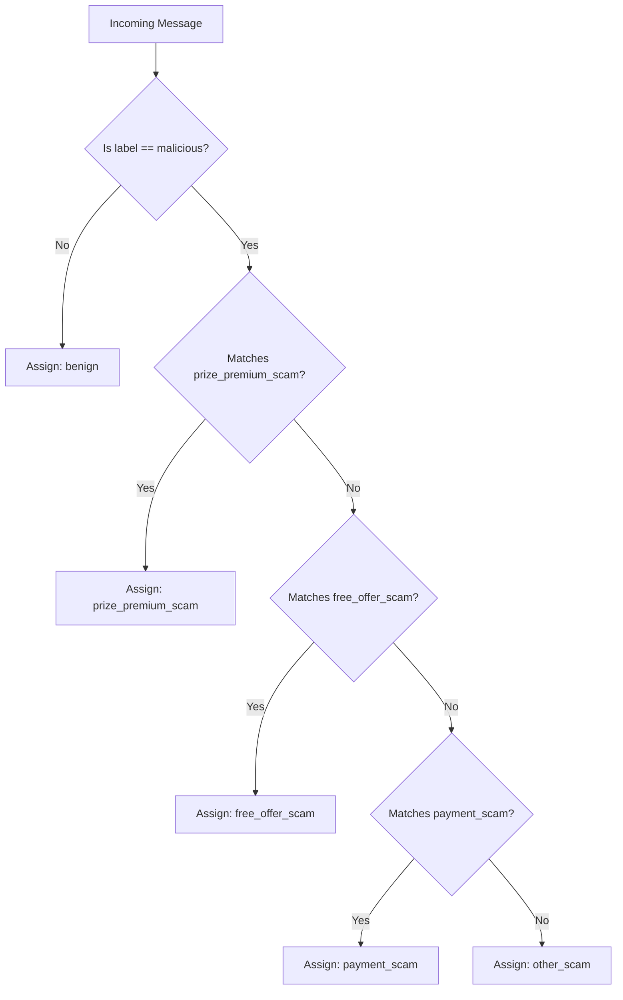

# ChainShield ML Pipeline & EDA Report

This report documents the exploratory data analysis (EDA), data cleaning, category labeling, and dataset characteristics for the ChainShield smishing detection pipeline.

---

## 1. Dataset Overview

The ChainShield smishing detection pipeline utilizes a merged and enriched dataset combining two primary sources:
1. **UCI Machine Learning Repository SMS Spam Collection**: A foundational SMS benchmark dataset consisting of real-world SMS communications.
2. **vinit9638/SMS-scam-detection-dataset (GitHub)**: A curated scam detection repository containing contemporary SMS scams, filtered strictly for English-language messages (`lang` in `['en', 'english']`).

### Data Cleaning and Deduplication Pipeline

To construct a reliable, high-quality corpus for threat classification, the combined raw dataset underwent systematic cleaning:
- **Text Normalization**: Stripped leading/trailing whitespace, collapsed duplicate consecutive whitespace characters, and normalized text encoding.
- **Label Standardization**: Standardized legacy labels into unified binary classifications (`ham` $\rightarrow$ `benign`, `spam` / `smishing` / `phishing` $\rightarrow$ `malicious`).
- **Exact Deduplication**: Identified and eliminated identical message strings (82 exact duplicate records removed).
- **Near-Duplicate Elimination**: Applied fuzzy string similarity via RapidFuzz token matching (`ratio >= 92`) across sliding windows to remove automated spam variations and near-identical broadcasts (18 near-duplicate records removed).
- **Cleaned Dataset Total**: Following deduplication and empty string filtering, the dataset totals exactly **6,031 rows** (reduced from 6,131 combined raw records).

| Pipeline Stage | Row Count | Benign (`ham`) | Malicious (`spam`) |
|---|---|---|---|
| Raw Merged Collection | 6,131 | 5,092 (83.05%) | 1,039 (16.95%) |
| Exact Duplicates Removed | -82 | - | - |
| Near-Duplicates Removed | -18 | - | - |
| **Final Cleaned Dataset** | **6,031** | **5,045 (83.65%)** | **986 (16.35%)** |

---

## 2. Exploratory Data Analysis (EDA)

### Class Balance

The cleaned dataset exhibits an approximate 5:1 ratio between benign and malicious communications, typical of real-world mobile traffic while retaining sufficient malicious samples for robust supervised learning:

| Class | Count | Percentage |
|---|---|---|
| benign | 5,045 | 83.65% |
| malicious | 986 | 16.35% |
| **Total** | **6,031** | **100.00%** |

```
label
benign       5045
malicious     986
Name: count, dtype: int64
Total rows: 6031
```

The underlying class balance evaluated during the raw EDA phase (5,092 ham vs. 1,039 spam across 6,131 raw rows) is visualized below:


---

### Message Length Distribution

Significant divergence exists in message character lengths between benign and malicious communications:

| Class | Count | Mean | Std | Min | 25% | 50% (Median) | 75% | Max |
|---|---|---|---|---|---|---|---|---|
| **benign** | 5,045 | 71.74 | 56.73 | 2.0 | 34.0 | 53.0 | 94.0 | 910.0 |
| **malicious** | 986 | 136.68 | 32.87 | 7.0 | 123.0 | 145.0 | 156.0 | 383.0 |

```
Summary Statistics (Character Length by Class):
            count        mean        std  min    25%    50%    75%    max
label                                                                    
benign     5045.0   71.738355  56.725455  2.0   34.0   53.0   94.0  910.0
malicious   986.0  136.684584  32.866086  7.0  123.0  145.0  156.0  383.0
```

#### Key Observations
1. **Malicious Clustering**: Malicious messages heavily concentrate near carrier SMS boundaries (mean: 136.68 characters; median: 145.0 characters; interquartile range: 123.0–156.0 characters). Fraudsters maximize persuasive payloads, fake urgency, callback numbers, and lure links within the single standard SMS limit (160 characters).
2. **Benign Skew**: Benign messages feature a much shorter median length (53.0 characters) and greater variance (std: 56.73), characterized by brief conversational exchanges alongside occasional long informational messages extending up to 910 characters.


---

### URL Presence and Lexical Patterns

- **URL Presence**: Malicious messages exhibit an order-of-magnitude higher propensity for including embedded hyperlinks (`http://`, `https://`, or `www.`):
  - **Benign**: 0.04% (2 of 5,045 messages)
  - **Malicious**: 16.23% (160 of 986 messages)
- **Frequent Terms**:
  - *Benign messages*: Dominated by personal conversational pronouns and everyday terms (`u`, `me`, `my`, `that`, `have`, `but`, `so`, `not`, `are`, `at`).
  - *Malicious messages*: Heavily feature call-to-action triggers, urgency tokens, and promotional vocabulary (`call`, `free`, `now`, `or`, `2`, `have`, `ur`, `txt`, `u`, `mobile`, `claim`, `stop`).

---

## 3. Category Labeling

### Context & Methodology

Publicly available SMS security corpora (such as the UCI SMS Spam Collection and open-source GitHub repositories) lack granular, category-level smishing annotations. To enable fine-grained threat intelligence and specialized downstream risk alerting, ChainShield implements a documented keyword-rule classification system.

This deterministic ruleset maps malicious messages into 4 distinct threat categories based on lexical cues, fraud mechanics, and threat vectors:

1. **`prize_premium_scam`**: Sweepstakes notifications, fake lottery winnings, ringtone/chat services, premium rate text subscriptions, and unsolicited reward claims.
2. **`free_offer_scam`**: Unsolicited promotional perks, device upgrade promotions, complimentary minutes, and bundled commercial incentives.
3. **`payment_scam`**: Financial fraud, banking credential harvesting, simulated government subsidies (e.g., COVID relief, tax refunds), account suspension threats, and urgent payment/verification requests.
4. **`other_scam`**: Malicious messages that lack explicit keyword markers for the above categories, serving as a well-defined residual scam class.

All benign messages retain the label **`benign`**.

---

### Category Distribution

The final categorized dataset (`data/processed/categorized.csv`) contains 6,031 messages distributed across the categories as follows:

| Category | Label | Count | % of All Messages | % of Malicious |
|---|---|---|---|---|
| **benign** | benign | 5,045 | 83.65% | - |
| **prize_premium_scam** | malicious | 576 | 9.55% | 58.42% |
| **other_scam** | malicious | 226 | 3.75% | 22.92% |
| **free_offer_scam** | malicious | 129 | 2.14% | 13.08% |
| **payment_scam** | malicious | 55 | 0.91% | 5.58% |
| **Total Malicious** | malicious | 986 | 16.35% | 100.00% |
| **Overall Total** | - | **6,031** | **100.00%** | - |

```
category
benign                5045
prize_premium_scam     576
other_scam             226
free_offer_scam        129
payment_scam            55
Name: count, dtype: int64
```

---

### Keyword Definitions & Rule Priority

The categorization engine evaluates patterns with strict word boundaries (`\b...\b`, case-insensitive). Rule priority is evaluated in descending order:



- **`prize_premium_scam` keywords**: `ringtone`, `tone`, `chat`, `dating`, `admirer`, `txt`, `reply`, `club`, `per msg`, `rcvd`, `landline`, `win`, `won`, `winner`, `prize`, `draw`, `congratulations`, `claim`
- **`free_offer_scam` keywords**: `free`, `upgrade`, `upto`, `mobile`, `camera`, `minutes`, `entitled`
- **`payment_scam` keywords**: `gov`, `payment`, `covid`, `tap here`, `apply`, `bank`, `account`, `verify`, `suspended`
- **`other_scam`**: Default catch-all for malicious texts with no matching keywords from the above sets.

---

### Category Ambiguity and Overlap Analysis

A formal consistency audit of `data/processed/categorized.csv` highlights key operational properties of the keyword-rule system:

- **100% Keyword Integrity**: Zero messages assigned to `prize_premium_scam`, `free_offer_scam`, or `payment_scam` lack their designated category keywords.
- **Adequate Modeling Support**: Every category satisfies the threshold of $\ge 50$ training examples (even the smallest category, `payment_scam`, provides 55 samples).
- **Category Ambiguity (220 messages / 22%)**: A total of **220 malicious messages (22% of all malicious records)** contain keywords matching two or more scam categories simultaneously.

#### Drivers of Ambiguity
This ambiguity is an authentic characteristic of smishing threats rather than a classification defect. Cybercriminals deliberately combine multiple persuasion hooks into single messages:
- *Prize + Free Offer*: Messages advertising a "free entry to win a £100,000 jackpot" match both prize triggers (`win`, `jackpot`) and commercial promotion triggers (`free`).
- *Prize + Payment/Banking*: Texts stating "your 2004 account statement shows unredeemed bonus points, claim now" link financial terminology (`account`) with reward collection (`claim`).
- *Free Offer + Premium Service*: Prompts offering "free hardcore ringtones or chat services" combine subscription lures (`ringtone`, `chat`) with zero-cost enticements (`free`).

The priority hierarchy ensures that ambiguous messages are resolved consistently and deterministically across all training, validation, and production splits.

---

## 4. Dataset Partitioning

The cleaned and categorized dataset of 6,031 rows is partitioned using a stratified 70/15/15 split:

| Split | Rows | Percentage | Benign Count | Malicious Count |
|---|---|---|---|---|
| **Train** | 4,221 | 70.0% | 3,531 | 690 |
| **Validation** | 905 | 15.0% | 757 | 148 |
| **Test** | 905 | 15.0% | 757 | 148 |
| **Total** | **6,031** | **100.0%** | **5,045** | **986** |

- **Leakage Prevention**: Cross-split contamination checks confirmed zero message overlap (evaluated via cryptographic hash matching across partitions).
